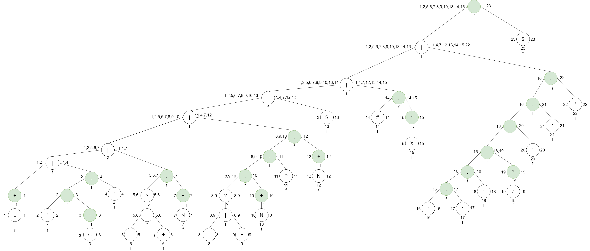
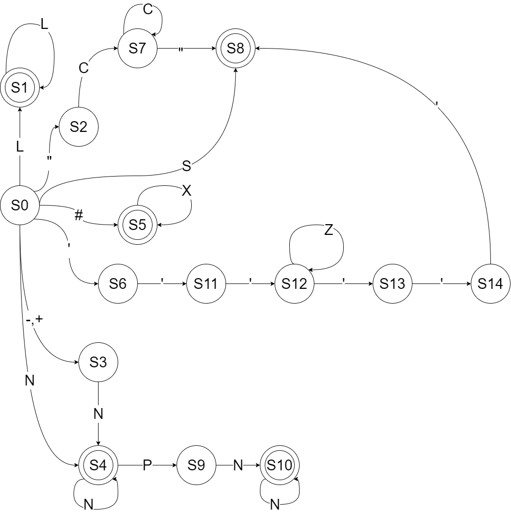

# Manual Técnico

## Descripción del proyecto
BizData (Business Data Analysis) es una plataforma diseñada para que las pequeñas empresas puedan tomar decisiones fundamentadas y estratégicas basadas en el análisis profundo de sus datos comerciales. La tarea del estudiante de Lenguajes Formales y de Programación es crear un analizador léxico y sintáctico, utilizando Python, que permita a las empresas cargar y analizar datos estructurados en un formato especializado con extensión “.bizdata”.

## Índice

- [Expresiones Regulares](#expresiones-regulares)
- [Análisis Léxico](#analizador-léxico)
- [Análisis Sintáctico]()

## Expresiones Regulares
Las expresiones regulares a partir de la cuál se realizo el AFD fueron las siguientes:

- **L** = {a-z,A-z}
- **N** = {0-9}
- **C** = {[^”]}
- **X** = {[^\n]}
- **Z** = {[^’]}
- **P** = {.}
- **S** = { (, ), [, ], {, }, :, ;, =, , }

### Unificación de las expresiones regulares
( L+ | “C+” | (+| -)?N+ | (+| -)?N+PN+ | S | #X* | ‘’’Z*’’’)$

### Tokens para indentificar cada expresión regular:

| Token | Expresión Regular  |
| --------- |:-------------:|
| KeyWord | L+ |
| Key  | "C+" |
| Integer | ( +| -)?N+ |
| Decimal | ( +| -)?N+PN+ |
| Simbols | S |
| SimpleComments | #X* |
| ComplexComments | ‘’’Z*’’’ |

## Analizador Léxico
Se presenta la imagen de la creación del método del árbol para la realización del AFD.

### Tabla de Siguiente Posición
| Nodo  | Simbolo | Siguiente Posición |
| ------------- | ------------- |:-------------:|
| 1 | L | {1, 23} |
| 2 | " | {3} |
| 3 | C | {3, 4} | 
| 4 | " | {23} |
| 5 | - | {7} |
| 6 | + | {7} |
| 7 | N | {7, 23} | 
| 8 | - | {10} |
| 9 | + | {10} |
| 10 | N | {10, 11} | 
| 11 | P | {12} | 
| 12 | N | {12, 23} | 
| 13 | S | {23} | 
| 14 | # | {15, 23} | 
| 15 | X | {15, 23} | 
| 16 | ' | {17} | 
| 17 | ' | {18} | 
| 18 | ' | {19, 20} | 
| 19 | Z | {19, 20} | 
| 20 | ' | {21} | 
| 21 | ' | {22} | 
| 22 | ' | {23} | 
| 23 | $ | - |

### AFD

## Analizador Sintáctico
Utilizando la notación BNF se creó la gramática para el analizador sintáctico.

**TERMINALES** : KEY, KEYWORD, EQUAL, LBRACE, RBRACE, LBRACKET, RBRACKET, LPAREN, RPAREN, COMMA, INTEGER, FLOAT, SEMICOLON, EOF

**NO TERMINAES** : <inicio>, <claves>, <registros>, <funciones>, <otra_clave>, <registros>, <registro>, <otroRegistro>, <valor>, <otroValor>, <funcion>, <parametros>, <otroParametro>, <otraFuncion>

**INICIO** : <inicio>

**PRODUCCIONES** :
    <inicio> ::= <claves> <registros> <funciones>
    <claves> ::= KEY EQUAL LBRACKET KEYWORD <otra_clave> RBRACKET
    <otra_clave> ::= COMMA KEYWORD <otra_clave> | ε

    <registros> ::= KEY EQUAL LBRACKET <registro> <otroRegistro> RBRACKET
    <registro> ::= LBRACE <valor> <otroValor> RBRACE
    <valor> ::= KEYWORD | INTEGER | FLOAT
    <otroValor> ::= COMMA <valor> <otroValor> | ε
    <otroRegistro> ::= <registro> <otroRegistro> | ε

    <funciones> ::= <funcion> <otraFuncion>
    <funcion> ::= KEY LPAREN <parametros> RPAREN SEMICOLON
    <parametros> ::= <valor> <otroParametro> | ε
    <otroParametro> ::= COMMA <valor> <otroParametro> | ε
    <otraFuncion> ::= <funcion> <otraFuncion> | ε